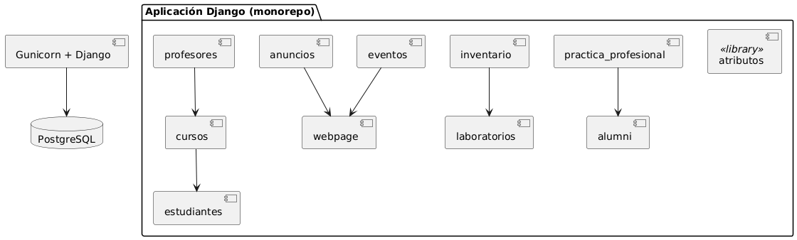
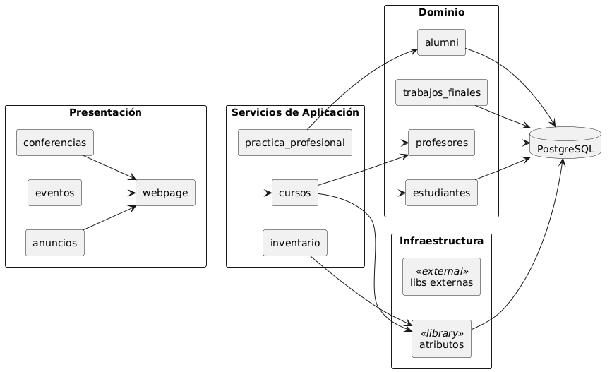
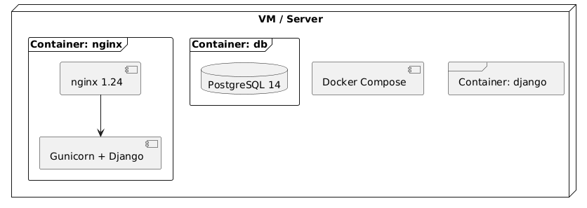

# IE-0417 · Proyecto EIEInfo  
## Avance #1 — Exploración y Análisis Inicial  
**Semana 1 (9 – 15 junio 2025)**

### 1. Descripción funcional breve
EIEInfo es el sistema de información que soporta las operaciones **académicas, administrativas y de extensión** de la Escuela de Ingeniería Eléctrica (EIE) de la UCR.  
Desde un navegador los distintos perfiles (estudiantes, docentes, administrativos y público externo) acceden a módulos que permiten:

| Dominio | Funciones principales |
|---------|-----------------------|
| **Académico** | Gestión de cursos, planes de estudio, horarios, matrícula y actas. |
| **Perfil de usuarios** | Autenticación, autorización por rol y administración de datos personales. |
| **Comunicación interna y difusión** | Anuncios, noticias, eventos, conferencias y boletines. |
| **Apoyo estudiantil** | Seguimiento de asistencias, práctica profesional, trabajos finales y bolsa de empleo. |
| **Administración de recursos** | Inventario de laboratorio, préstamos de equipos, control de salas y reservas. |
| **Alumni y extensión** | Gestión de egresados, educación continua y proyectos de vinculación. |

### 2. Diagrama de arquitectura

#### 2.1 Vista lógica  

La vista lógica responde a qué partes conceptuales componen el sistema y cómo se relacionan. Agrupa el código por responsabilidad de negocio y por capa de la aplicación.

| Capa | Qué contiene | Ejemplo de apps | Responsabilidad clave | Dependencias |
|------|--------------|-----------------|----------------------|--------------|
| **Presentación** | Views, Templates, Forms, estáticos | webpage, anuncios, eventos | Renderizar páginas y APIs REST/JSON, validar input de usuario | → Servicios de Aplicación |
| **Servicios de Aplicación** | Casos de uso, orquestación de transacciones | cursos, inventario | Coordinar flujo entre dominio, notificaciones, jobs, permisos | → Dominio |
| **Dominio** | Entidades, reglas de negocio, aggregate roots | estudiantes, profesores, trabajos_finales | Garantizar invariantes (p. ej. «un estudiante no puede inscribir dos veces el mismo curso») | → Infraestructura |
| **Infraestructura** | Repositorios ORM, gateways externos, librerías | atributos, libs (Select2, Martor) | Persistencia, envíos de correo, CAPTCHA, OAuth | → Base de Datos |
| **Base de Datos** | Esquema normalizado (PostgreSQL 14) | — | Almacenar estado consistente | — |

> **Patrón de dependencias:** las flechas sólo bajan —Presentación → Servicios → Dominio → Infraestructura → DB—, de modo que las reglas de negocio permanecen aisladas del framework y la UI.

**Relación entre módulos clave**

| Módulo | Depende de | Motivo |
|--------|------------|---------|
| cursos | estudiantes, profesores | validar matrícula y asignación de docente |
| inventario | laboratorios, atributos | ubicación física y catálogos de equipos |
| practica_profesional | alumni, profesores | - |
| anuncios / eventos | webpage | compartir componentes de interfaz y permisos |
| atributos | — | librería de catálogos para todas las apps |

#### 2.2 Vista física o virtual del servidor

> **Flujo principal:** Navegador → Nginx (reverse-proxy, estáticos y TLS) → Gunicorn → Django → PostgreSQL.
> **CI/CD:** Pipeline definido en `.drone.yml` ejecuta pruebas (`pytest-django`) y despliega contenedores.

### 3. Módulos y tecnologías principales

| Capa                    | Tecnología                                                             | Evidencia en repo                              |
| ----------------------- | ---------------------------------------------------------------------- | ---------------------------------------------- |
| **Back-end**            | Python 3.10, Django 4.1.3, Gunicorn                                    | `requirements.txt`, `docker/django/Dockerfile` |
| **Front-end rendering** | Plantillas Django + Static files (Bootstrap, jQuery, Select2)          | `src/webclients/*`                             |
| **Base de datos**       | PostgreSQL 14                                                          | `docker/db/Dockerfile`, `init.sql`             |
| **Contenedores**        | Docker + Docker Compose                                                | `docker/*`                                     |
| **Web server**          | Nginx 1.24 (reverse proxy + TLS)                                       | `docker/nginx`                                 |
| **Autenticación**       | Django auth, Google OAuth opcional (social-login)                      | `settings.py`                                  |
| **Tareas programadas**  | `django-crontab`                                                       | `requirements.txt`, `settings.py`              |
| **CI/CD**               | Drone CI (`.drone.yml`)                                                | Raíz del repo                                  |
| **Librerías clave**     | `django-polymorphic`, `martor` (markdown), `django-select2`, ReCAPTCHA | `requirements.txt`                             |

**Apps Django (19):** `administrativos`, `alumni`, `anuncios`, `asistencias`, `atributos`, `cursos`, `conferencias`, `estudiantes`, `eventos`, `inventario`, `laboratorios`, `practica_profesional`, `profesores`, `proyecto_electrico`, `proyectos`, `trabajos_finales`, `webpage`, `scripts`, además del proyecto raíz `eieinfo`.

### 4. Plan de trabajo del grupo

| Rol / Entregable                                 | Responsable(s)                 | Herramientas / entregables concretos                   | Fecha objetivo    |
| ------------------------------------------------ | ------------------------------ | ------------------------------------------------------ | ----------------- |
| **Documentación y reportes (README por avance)** | Mauricio Jiménez               | Markdown + PlantUML                                    | Semanal (domingo) |
| **Análisis del sistema actual**                  | José Acevedo, Mauricio Jiménez | Mapas de componentes, matríz de dependencias           | 15-jun            |
| **Evaluación de calidad técnica**                | José Acevedo                   | SonarQube, pylint/flake8 report, métricas de cobertura | 22-jun            |
| **Exploración del proceso de desarrollo**        | Mauricio Jiménez               | Análisis de flujo Git, CI/CD, convenciones de commits  | 22-jun            |
| **Entrevistas con stakeholders**                 | José Acevedo, Mauricio Jiménez | Guion, transcripciones, hallazgos                      | 29-jun            |
| **Propuesta de mejoras**                         | José Acevedo, Mauricio Jiménez | Documento de recomendaciones priorizadas               | 06-jul            |
| **Conclusiones y presentación**                  | José Acevedo, Mauricio Jiménez | Diapositivas/Poster + demo                             | 08-jul            |

**Siguientes pasos inmediatos**

1. **Validar acceso al entorno Docker** (levantar stack local con `docker-compose up` y documentar pasos).  
2. **Ejecutar inventario de dependencias** (`pip -r requirements.txt` + `pipdeptree`) y generar SBOM preliminar. 