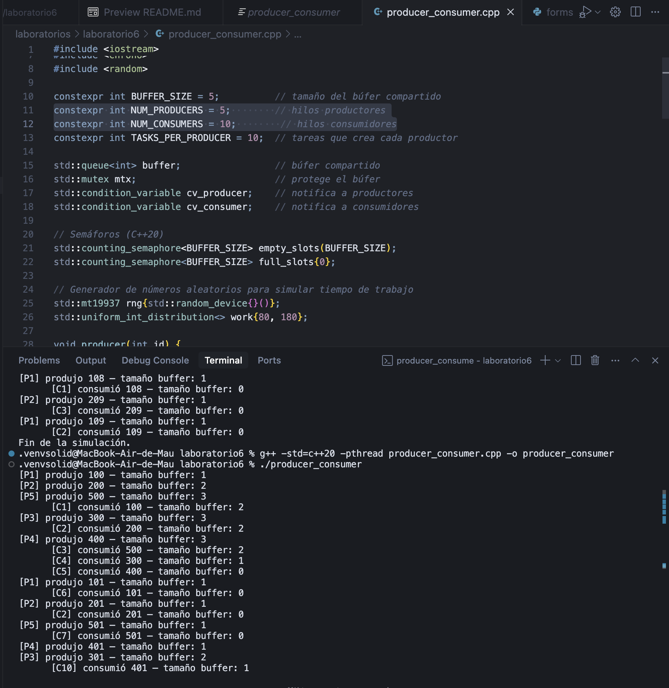

# Laboratorio 6 - Productores-Consumidores

Este laboratorio implementa el clásico problema de los productores-consumidores usando C++20, demostrando el uso de:
- Mutex
- Variables de condición
- Semáforos
- Hilos

## Requisitos

- Compilador C++ con soporte C++20 (GCC 10+, Clang 12+, MSVC 2019 16.10+)
- Pthread (ya viene con GCC/Clang en Linux; en Windows usa la opción -pthread con MinGW W64)

## Compilación y Ejecución

### Linux / macOS
```bash
g++ -std=c++20 -pthread producer_consumer.cpp -o producer_consumer
./producer_consumer
```

### Windows (MSYS2 / MinGW W64)
```bash
g++ -std=c++20 -pthread producer_consumer.cpp -o producer_consumer.exe
producer_consumer.exe
```

## Parámetros del Programa

- `BUFFER_SIZE`: Tamaño del búfer compartido (5 por defecto)
- `NUM_PRODUCERS`: Número de hilos productores (2 por defecto)
- `NUM_CONSUMERS`: Número de hilos consumidores (3 por defecto)
- `TASKS_PER_PRODUCER`: Tareas que crea cada productor (10 por defecto)

## Experimentos Sugeridos

1. Cambiar `BUFFER_SIZE` y observar cómo aumenta o disminuye la congestión
2. Incrementar `NUM_PRODUCERS` o `NUM_CONSUMERS` para ver cómo se equilibra la producción y el consumo
3. Quitar los `sleep_for` o hacerlos más largos para apreciar bloqueos
4. Introducir un deadlock a propósito ocupando dos mutex y ver cómo se detiene el programa

## Posibles Errores y Soluciones

| Mensaje | Causa común | Solución |
|---------|-------------|----------|
| `std::counting_semaphore is not a member of std` | Compilador sin soporte C++20 o encabezado faltante | Actualiza GCC/Clang o usa -std=c++20; asegúrate de incluir <semaphore> |
| `ld: cannot find -pthread` | Opción mal escrita | Usa -pthread (dos guiones) en lugar de -lpthread en GCC moderno |
| Ejecución "congelada" | Deadlock por mal orden de acquire/release | Revisa que cada acquire() tenga su release() correspondiente y que el orden de bloqueo sea consistente | 

## Screenshots

### Ejecución Normal con NUM_PRODUCERS = 5 y NUM_CONSUMERS = 10;
