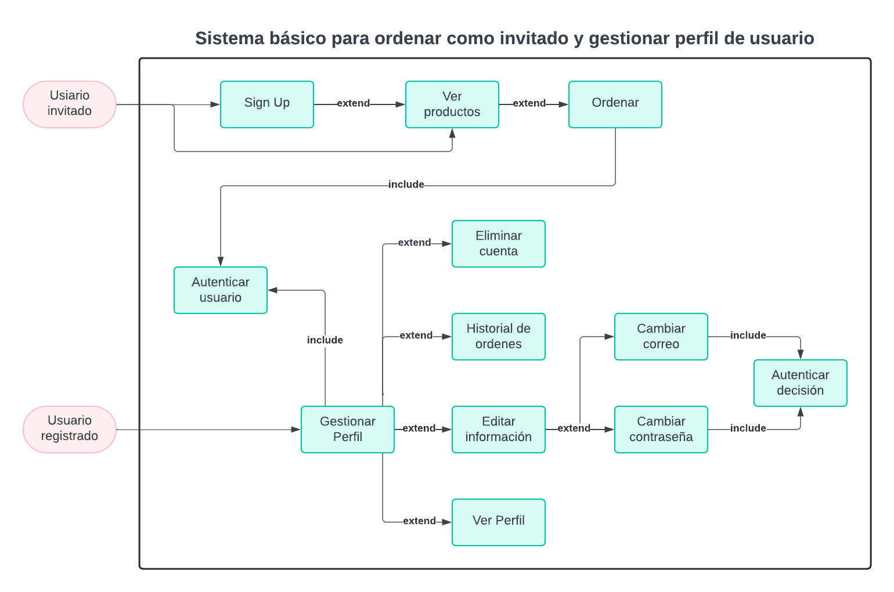

# Laboratorio 03: Análisis de requerimientos y modelado de casos de uso

### Tabla de contenidos
1. [Escenario](#escenario)
2. [Lista de Requerimientos](#lista-de-requerimientos)
3. [Casos de Uso](#casos-de-uso)
4. [Diagrama UML](#diagrama-uml)

## Escenario

## Lista de Requerimientos

| Funcionales     | No funcionales | Técnicos  | Interfaz |
|:---------:|:----:|:--------:|:--------:|
| *Interfaz de Login: Permitir a los usuarios registrarse e iniciar sesión utilizando nombre, correo electrónico, número telefónico y contraseña.    |  **Confirmación de Reservación con Baja Latencia: Asegurar que la confirmación de la reservación se realice en menos de 2 segundos. |   **Base de Datos PostgreSQL: Utilizar PostgreSQL para la gestión de datos.    |   **API de OpenAI para Chatbot*: Integrar un API de OpenAI para el funcionamiento del chatbot.    |
| *Despliegue del Menú Hamburger: Mostrar opciones como "Quienes Somos", "Cliente", "Servicio", "Home" y "Ordenar".      |  **Latencia del Chatbot*: Garantizar que el chatbot responda en menos de 4 segundos. |    |    |
| *Agendar Reservas mediante Chatbot: Facilitar la reserva de mesas a través de un chatbot interactivo.  |  **Visualización Responsiva*: Asegurar que la plataforma se adapte correctamente a diferentes tamaños de pantalla y dispositivos. |        |        |
| *Formulario de Pedido*: Permitir a los usuarios realizar pedidos mediante un formulario intuitivo. |  |  |
| *Carrito de Compras*: Implementar un carrito de compras donde los usuarios puedan revisar y modificar sus pedidos antes de confirmar. |  |  |
| *Página del Menú con Filtros*: Mostrar el menú del restaurante con opciones de filtrado por categoría, precio, y popularidad. |  |  |

## Casos de Uso

### Caso 1: Realizar Pedido

<table>
  <tr>
    <th style="background-color:#004080; color:white; padding:8px;">Precondiciones</th>
    <th style="background-color:#004080; color:white; padding:8px;">Postcondiciones</th>
  </tr>
  <tr>
    <td style="padding:8px;">El usuario debe estar registrado e iniciado sesión.</td>
    <td style="padding:8px;">El pedido se registra en la base de datos y se envía una confirmación al usuario por correo.</td>
  </tr>
</table>

 

<table>
  <tr>
    <th style="background-color:#006400; color:white; padding:8px;">Flujo Principal</th>
    <th style="background-color:#006400; color:white; padding:8px;">Flujo Alternativo</th>
  </tr>
  <tr>
    <td style="padding:8px;">
      1. El usuario selecciona los productos del menú. 
      2. Añade los productos al carrito de compras. 
      3. Revisa el carrito y procede al pago. 
      4. El sistema procesa el pago y confirma el pedido.
    </td>
    <td style="padding:8px;">
      1. El usuario modifica el carrito antes de pagar. 
      3. El pago falla y el usuario intenta nuevamente.
    </td>
  </tr>
</table>

 

### Caso 2: Reservar mesa
<table>
  <tr>
    <th style="background-color:#004080; color:white; padding:8px;">Precondiciones</th>
    <th style="background-color:#004080; color:white; padding:8px;">Postcondiciones</th>
  </tr>
  <tr>
    <td style="padding:8px;">
      El usuario debe estar registrado e iniciado sesión.
    </td>
    <td style="padding:8px;">
      La reserva se registra en la base de datos y se envía una confirmación al usuario.
    </td>
  </tr>
</table>

 

<table>
  <tr>
    <th style="background-color:#006400; color:white; padding:8px;">Flujo Principal</th>
    <th style="background-color:#006400; color:white; padding:8px;">Flujo Alternativo</th>
  </tr>
  <tr>
    <td style="padding:8px;">
      1. El usuario inicia una conversación con el chatbot. 
      2. Proporciona detalles de la reserva (fecha, hora, número de personas). 
      3. El chatbot verifica la disponibilidad y confirma la reserva.
    </td>
    <td style="padding:8px;">
      2a. El usuario modifica los detalles de la reserva. 
      3a. No hay disponibilidad y el chatbot ofrece alternativas.
    </td>
  </tr>
</table>
 

#### Caso 3: Gestionar perfil de usuario
<table>
  <tr>
    <th style="background-color:#004080; color:white; padding:8px;">Precondiciones</th>
    <th style="background-color:#004080; color:white; padding:8px;">Postcondiciones</th>
  </tr>
  <tr>
    <td style="padding:8px;">
      El usuario debe estar registrado e iniciado sesión.  
    </td>
    <td style="padding:8px;">
      El perfil del usuario queda actualizado o eliminado según la acción realizada. Se notifican los cambios si corresponde.
    </td>
  </tr>
</table>

<table>
  <tr>
    <th style="background-color:#006400; color:white; padding:8px;">Flujo Principal</th>
    <th style="background-color:#006400; color:white; padding:8px;">Flujo Alternativo</th>
  </tr>
  <tr>
    <td style="padding:8px;">
      1. El usuario accede a la sección de perfil. 
      2. Visualiza su información personal. 
      3. Edita datos como nombre, correo o contraseña. 
      4. El sistema valida los cambios y actualiza la información.
    </td>
    <td style="padding:8px;">
      3a. El usuario solicita eliminar su cuenta. Se solicita confirmación. 
      4a. Los datos ingresados no son válidos. El sistema muestra errores y solicita correcciones. 
    </td>
  </tr>
</table>

## Diagrama UML

