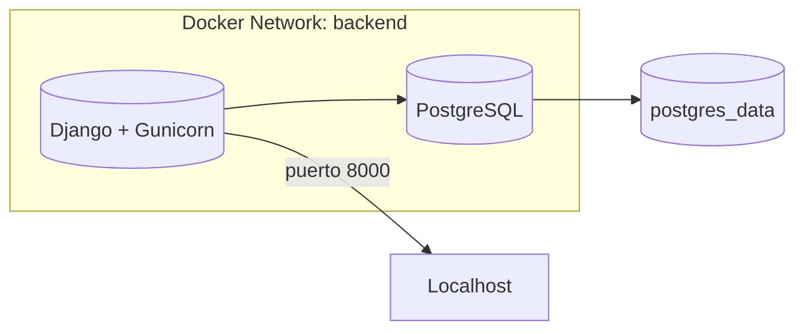
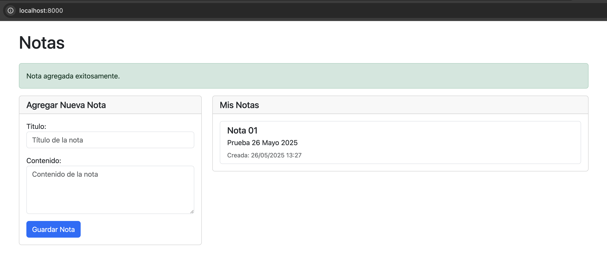
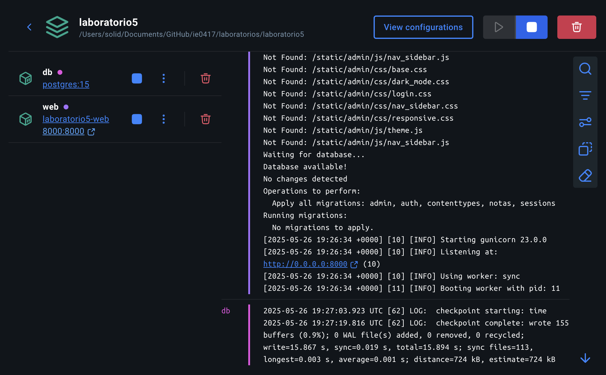

# Laboratorio 5: Despliegue de Django con Docker

## 1. Diagrama de arquitectura



## 2. Descripción de archivos clave

* **requirements.txt**: Lista de dependencias: Django, Gunicorn, psycopg2-binary, python-dotenv.
* **Dockerfile**: Construye imagen, instala dependencias, aplica migraciones y recolecta estáticos.
* **docker-compose.yml**: Orquesta `db` y `web` en red `backend`, monta volúmenes y carga variables de entorno desde `.env`.
* **notas**: App sencilla con modelo de Nota, vista de lista y plantilla HTML.

## 3. Pasos para ejecutar

1. Copiar `.env.example` a `.env` y configurar.
2. Levantar contenedores:

   ```bash
   docker-compose up --build
   ```
3. Acceder a `http://localhost:8000` y al admin en `/admin/`.

## Vista de la aplicación




## 4. Conclusiones

Este laboratorio muestra cómo contenerizar una aplicación Django con PostgreSQL usando Docker y Docker Compose, aplicando buenas prácticas de configuraciones y separación de entornos.

## Autores

- Jose Acevedo. Carné: B90034 
- Mauricio Jiménez. Carné: A62970 